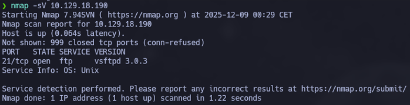
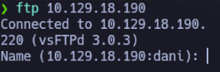
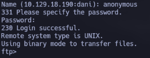

# HTB: Fawn
- Dirección IP Objetivo: 10.129.18.190
- Dificultad: Muy Fácil (Debugging)
- Autor: Daniel Barbeyto Torres
- Fecha: 2025-12-11

## I. Resumen Ejecutivo (Executive Summary)
La máquina objetivo, Fawn, fue comprometida a nivel de root mediante un fallo de configuración en el servicio FTP (vsFTPd 3.0.3). El servidor permitía el acceso anónimo  sin requerir credenciales válidas. Este acceso anónimo reveló el directorio raíz del servicio, donde se alojaba directamente la flag de compromiso, obteniendo así la victoria sin necesidad de escalada de privilegios.

## II. Enumeración y Descubrimiento (Reconnaissance)
El objetivo de esta fase es familiarizarse con el estado actual de la máquina y sus servicios.

### 2.1. Verificación de Conectividad (Ping)
Se verificó la accesibilidad de la máquina objetivo mediante un ping ICMP, confirmando la existencia de conectividad con la IP 10.129.18.190.

### 2.2. Escaneo de Puertos y Servicios (Nmap)
Se procedió a realizar un escaneo detallado de puertos utilizando Nmap con la detección de servicios (-sV).

Comando Ejecutado:
```bash
nmap -sV 10.129.18.190
```


Resultado: El escaneo reveló que solamente el puerto 21/tcp se encontraba abierto, ejecutando el servicio File Transfer Protocol (FTP) con la versión vsFTPd 3.0.3. El FTP es un protocolo de comunicación estándar utilizado para transferir archivos de un servidor a un cliente, utilizando una arquitectura cliente-servidor con conexiones de control y datos independientes.

## III. Proceso de Explotación
### 3.1. Conexión al Servicio FTP
Para acceder al servicio FTP, se utilizó el cliente nativo del host. Es una buena práctica asegurarse de que el cliente esté actualizado.

Comando Ejecutado:
```bash
ftp 10.129.18.190
```



La conexión fue exitosa, mostrando la versión del servicio y solicitando un nombre de usuario.

### 3.2. Abuso de Acceso Anónimo
Los usuarios de FTP suelen autenticarse con un protocolo de inicio de sesión de texto sin cifrar, pero pueden conectarse de forma anónima si el servidor lo permite.

Se intentó iniciar sesión como usuario anonymous, una configuración que a menudo se realiza incorrectamente.

Nombre de usuario: anonymous
Contraseña: (Se dejó vacía o se introdujo cualquier valor, ya que el servicio suele descartar la contraseña en el modo anónimo).



El login fue exitoso, confirmando la vulnerabilidad de acceso anónimo.

### 3.3. Recuperación de la Flag
Una vez autenticados, se listó el contenido del directorio con el comando ls o dir. Se identificó el archivo flag.txt en el directorio actual.
Para obtener el archivo, se utilizó el comando get.

Comando Ejecutado (dentro de la shell FTP):
```bash
get flag.txt
```


El archivo se descargó correctamente al sistema local.

### 3.4. Confirmación del Compromiso
Se salió del cliente FTP con el comando exit. Finalmente, se visualizó el contenido del archivo flag.txt en la terminal local.

Comando Ejecutado (en la terminal local):
```bash
cat flag.txt
```


## V. Conclusión y Remedios
### 5.1. Impacto
La máquina Fawn presentó una vulnerabilidad crítica debido a la activación y mala configuración del acceso anónimo a través de FTP, permitiendo la lectura directa de archivos sensibles (la flag de compromiso) por parte de cualquier usuario.

### 5.2. Recomendaciones de Seguridad
Se recomienda la aplicación de las siguientes medidas correctivas:
- Deshabilitar el Acceso Anónimo: El acceso anónimo debe estar deshabilitado a menos que sea estrictamente necesario y la información expuesta sea intencionalmente pública.
- Restricción de Directorios: Si se requiere FTP anónimo, el directorio root de FTP debe estar configurado para ser un entorno chroot y no debe contener archivos sensibles o de sistema.
- Reemplazo de Protocolo: Para la transmisión segura que proteja credenciales y encripte el contenido , FTP debe protegerse con SSL/TLS (FTPS) o sustituirse por un protocolo más seguro como SFTP (Protocolo de Transferencia de Archivos SSH).
