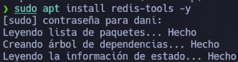
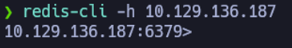
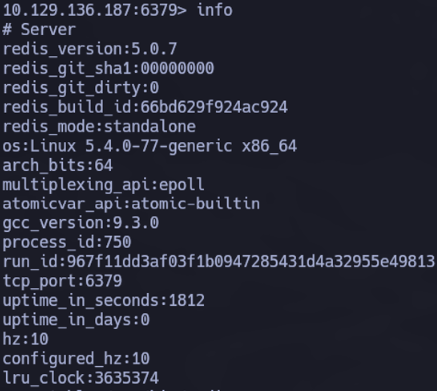
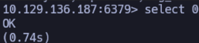
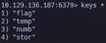
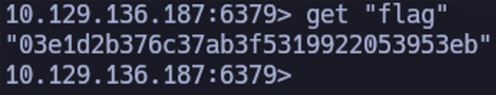

# HTB: Redeemer
- Dirección IP Objetivo: 10.129.136.187
- Sistema Operativo: Linux
- Dificultad: Muy Fácil (Tier 0)
- Autor: Daniel Barbeyto Torres
- Fecha: 2025-12-11

## I. Resumen Ejecutivo (Executive Summary)
La máquina objetivo, Redeemer, fue comprometida mediante la explotación de un servidor de base de datos Redis mal configurado. El servicio se encontraba expuesto públicamente sin requerir autenticación. Esto permitió a un atacante conectarse remotamente utilizando la herramienta redis-cli, enumerar las bases de datos disponibles y extraer información sensible (la flag) almacenada en texto plano en la memoria.

## II. Introducción Teórica: ¿Qué es Redis?
Antes de proceder, es importante entender el objetivo. Redis (Remote Dictionary Server) es una base de datos no-SQL de código abierto. A diferencia de las bases de datos tradicionales que almacenan todo en disco, Redis es del tipo "in-memory", lo que significa que almacena los datos principalmente en la memoria RAM del sistema.

Esto le otorga una velocidad de respuesta extremadamente rápida , pero también implica riesgos críticos si no se asegura correctamente, ya que los datos suelen ser accesibles y modificables fácilmente.

## III. Enumeración y Descubrimiento (Reconnaissance)
### 3.1. Verificación de Conectividad
Se verificó la accesibilidad de la máquina objetivo mediante un ping ICMP.

### 3.2. Escaneo de Puertos y Servicios
Se realizó un escaneo dirigido al puerto estándar de Redis (6379) utilizando Nmap con detección de versiones (-sV).

Comando Ejecutado:

```bash
nmap -p 6379 -sV 10.129.136.187
```


Resultado: El escaneo confirmó que el puerto 6379/tcp estaba abierto y ejecutando Redis key-value store 5.0.7.

## IV. Proceso de Explotación
### 4.1. Preparación de Herramientas
Para interactuar con el servidor remoto, se requiere la utilidad de línea de comandos redis-cli. Se procedió a instalar las herramientas necesarias en la máquina atacante (si no estaban ya presentes).

Comando Ejecutado:

```bash
sudo apt install redis-tools -y
```



Esta instalación nos proporciona el comando redis-cli, esencial para enviar comandos al servidor.

### 4.2. Conexión al Servidor Redis
Se utilizó redis-cli especificando el hostname (IP) del objetivo con el flag -h. Al no conocerse credenciales, se intentó una conexión sin autenticación.

Comando Ejecutado:

```bash
redis-cli -h 10.129.136.187
```



La conexión fue exitosa y se obtuvo el prompt interactivo de Redis (10.129.136.187:6379>), lo que indica la ausencia de contraseña.

### 4.3. Enumeración de la Base de Datos
Una vez dentro, se utilizó el comando info para obtener estadísticas e información del servidor. Se prestó especial atención a la sección Keyspace (al final del output), que indica qué bases de datos existen y cuántas claves contienen.



Resultado: La sección Keyspace reveló la existencia de una única base de datos (index 0) con 4 claves almacenadas (db0:keys=4).


### 4.4. Extracción de Datos (Flag)
Para acceder a los datos, primero se debe seleccionar la base de datos correcta (en este caso, la 0).

Comando:

```bash
select 0
```



Posteriormente, se listaron todas las claves (keys) disponibles en dicha base de datos para identificar información de interés.

Comando:

```bash
keys *
```



El listado mostró cuatro claves: "flag", "temp", "numb", y "stor". La clave llamada "flag" era claramente el objetivo. Se procedió a leer su valor con el comando get.

Comando Final:

```bash
get "flag"
```



El servidor devolvió el hash de la flag, completando así el reto.

## V. Conclusión y Remedios
### 5.1. Impacto
La exposición de un servidor Redis sin autenticación permite a cualquier atacante leer, modificar o eliminar la totalidad de la información almacenada en la memoria del servidor. Dependiendo del uso de la base de datos, esto podría llevar al robo de sesiones, credenciales o datos sensibles de negocio.

### 5.2. Recomendaciones de Seguridad
Habilitar Autenticación: Configurar la directiva requirepass en el archivo redis.conf para exigir una contraseña fuerte antes de permitir la ejecución de comandos.
- Bind a Localhost: Si el acceso remoto no es estrictamente necesario, Redis debe configurarse para escuchar únicamente en la interfaz de localhost (bind 127.0.0.1), impidiendo conexiones externas.
- Firewall: Implementar reglas de firewall para restringir el acceso al puerto 6379 únicamente a direcciones IP de confianza.
